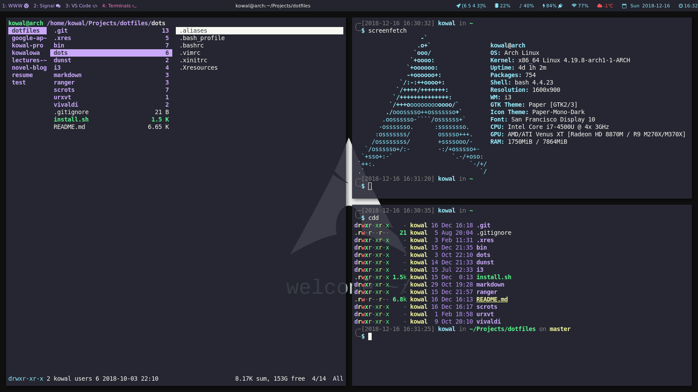

# dotfiles <!-- omit in toc -->

My Arch configuration files



`install.sh` installs below applications and does some configuration. Use it without any warranty!

## TOC <!-- omit in toc -->

- [i3-gaps](#i3-gaps)
- [i3 scripts](#i3-scripts)
  - [weather](#weather)
- [dots symlinks](#dots-symlinks)
- [dunst](#dunst)
- [ranger](#ranger)
- [urxvt](#urxvt)
- [.xres](#xres)
- [.vimrc](#vimrc)

## i3-gaps

To run properly i3-gaps based on this configuration you have to install following programs:

- `yay` ([installation instructions](https://computingforgeeks.com/yay-best-aur-helper-for-arch-linux-manjaro/); for installing AUR packages)
- `i3-gaps` fork of `i3` (AUR) ([installation instructions](https://github.com/Airblader/i3))
- `rofi` (for searching and launching apps)
- `i3blocks` (for bar with custom informations)
- `i3lock-color-git` (AUR) (for locking screen)
- `feh` (for setting wallpaper; put wallpaper to `~/Pictures/wallpaper.jpg`)
- `system-san-francisco-font-git`, `ttf-ms-fonts` (AUR; system font)
- `ttf-font-awesome-4` (AUR; font with nice icons - use v4 - v5 breaks compatibility)
- `paper-gtk-theme-git`, `paper-icon-theme-git` (AUR; Paper System Theme - nice theme)
- `lxappearance` (for changing system font and theme; change font in `~/.gtkrc-2.0` and in `~/.config/gtk-3.0/settings.ini`)
- `urxvt` terminal
- `pulseaudio` (for audio control)
- `playerctl` (also for audio control)
- `imagemagick` (AUR; for converting images to set them as lock screen)
- `compton` (for nice transitions)
- `acpi` (for getting battery info)
- `scrot` (for making screenshots; also create directory `~/Pictures/screenshots`)
- `xss-lock-git` (AUR; for locking screen after suspend. To suspend after closing lid, go to `/etc/systemd/logind.conf`, uncomment `HandleLidSwitch=suspend`)
- `numlockx` (for turning on numlock on start)
- `ranger` `w3m` (console based file manager)
- `vivaldi` (To use Netflix install from AUR `vivaldi-widevine` and `vivaldi-ffmpeg-codecs`)
- `code` (AUR; nice editor for programmers)
- `spotify` (AUR), before installing add following gpg keys:
- `exa` for colored `ls` output
- `dunst` for display notifications
- `youtube-dl` best [YT downloader](https://github.com/rg3/youtube-dl/)
- `signal` (AUR) secure [messenger](https://signal.org)

```sh
gpg --recv-keys --keyserver hkp://pgp.mit.edu D9C4D26D0E604491
gpg --recv-keys 5CC908FDB71E12C2
```

It is worth to make symlink from repo to i3 config folder (assuming that i3 config is in `~/.config/i3`):

```sh
rm -rf ~/.config/i3
ln -s $DOTS/i3 ~/.config
```

## i3 scripts

### weather

Make account on openweathermap.org and obtain API key. Then rename `weather.cfg.example` to `weather.cfg` and update this file with your API key.

## dots symlinks

Symlink all files from `dots/` to `~/`

```sh
ln -s $DOTS/dots/.* ~/
```

Then reload `.Xresources`:

```sh
source ~/.Xresources
```

## dunst

Create symlink:

```sh
rm -rf ~/.config/dunst
ln -s $DOTS/dunst ~/.config
```

## ranger

Create symlink:

```sh
rm -rf ~/.config/ranger
ln -s $DOTS/ranger ~/.config
```

## urxvt

To get to work normal copy-paste in terminal create symlink:

```sh
sudo ln -s $DOTS/urxvt/pasta /usr/lib/urxvt/perl/
```

## .xres

To get to work `.xres` create symlink:

```sh
ln -s $DOTS/.xres ~/
```

## .vimrc

Install [dracula theme](https://draculatheme.com/vim/)

Install [pathogen](https://github.com/tpope/vim-pathogen) for plugins management.
Now you can install:

- [CtrlP](https://github.com/kien/ctrlp.vim) (for fuzzy search)
- [NERDTree](https://github.com/scrooloose/nerdtree) (for file tree)
